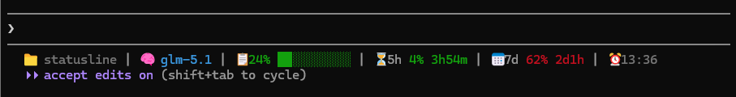

# claude-code-glm-statusline

English | [中文](README.md)

A custom statusline for **Claude Code**, designed for **Zhipu GLM Coding Plan** subscribers.

Displays model info, context usage, and 5-hour / 7-day API quotas in real-time — so you always know your consumption at a glance.

## Preview



```
📁 statusline | 🧠 glm-5.1 | 📋42% ██████░░░░ | ⏳5h 62% 2h30m | 📅7d 45% 5d12h | 🕐13:16
```

- **Directory** — Current working directory
- **Model** — Active GLM model
- **Context** — Context window usage with color-coded progress bar (green → yellow → red)
- **5h Quota** — 5-hour sliding window token usage + reset countdown
- **7d Quota** — 7-day sliding window token usage + reset countdown
- **Time** — Current time

## Prerequisites

- [Node.js](https://nodejs.org/) >= 18
- [Claude Code](https://docs.anthropic.com/en/docs/claude-code) CLI
- Zhipu Coding Plan subscription ([Sign up](https://open.bigmodel.cn/))
- **Zhipu Usage Query Plugin (glm-plan-usage)** — quota data depends on this plugin

> **Installing the usage query plugin:** Use Zhipu's official Coding Tool Helper for automatic setup:
> ```bash
> npx @z_ai/coding-helper
> ```
> In the wizard, select **Plugin Marketplace** → install the **glm-plan-usage** plugin.
>
> Or install manually:
> ```bash
> claude plugin marketplace add zai-org/zai-coding-plugins
> claude plugin install glm-plan-usage@zai-coding-plugins
> ```
>
> See [Usage Query Plugin docs](https://docs.bigmodel.cn/cn/coding-plan/extension/usage-query-plugin) and [Coding Tool Helper](https://docs.bigmodel.cn/cn/coding-plan/extension/coding-tool-helper) for details.

## Quick Install

```bash
npx claude-code-glm-statusline
```

Restart Claude Code after installation to see the statusline.

## Manual Install

If `npx` is not available:

1. Download `src/statusline.mjs` to `~/.claude/`:

```bash
curl -o ~/.claude/statusline.mjs https://raw.githubusercontent.com/Darkycl/claude-code-glm-statusline/main/src/statusline.mjs
```

2. Edit `~/.claude/settings.json` and add the `statusLine` config:

```json
{
  "statusLine": {
    "type": "command",
    "command": "node ~/.claude/statusline.mjs"
  }
}
```

Windows users should use the full path:

```json
{
  "statusLine": {
    "type": "command",
    "command": "node C:/Users/<your-username>/.claude/statusline.mjs"
  }
}
```

## Environment Variables

Make sure `~/.claude/settings.json` has the GLM API configured in `env`:

```json
{
  "env": {
    "ANTHROPIC_BASE_URL": "https://open.bigmodel.cn/api/anthropic",
    "ANTHROPIC_AUTH_TOKEN": "<your-api-token>"
  }
}
```

## Uninstall

1. Edit `~/.claude/settings.json` and remove the `statusLine` field
2. Delete the script and cache files:

```bash
rm ~/.claude/statusline.mjs ~/.claude/quota_cache.json
```

## How It Works

- The script reads JSON from Claude Code's stdin to extract model and context info
- Quota data is fetched from Zhipu's platform API (`/api/monitor/usage/quota/limit`)
- Quota data is cached for 5 minutes to avoid frequent API calls
- ANSI color codes and Unicode characters are used for progress bar rendering

## FAQ

**Q: Quota info is not showing?**

Ensure `ANTHROPIC_BASE_URL` points to `https://open.bigmodel.cn/api/anthropic` and `ANTHROPIC_AUTH_TOKEN` is set correctly.

**Q: Does it work with the official Anthropic API?**

The quota display relies on Zhipu's proprietary API. If you use the official Anthropic API, context usage and model info will still work.

**Q: Does it support Windows?**

Yes. The install script auto-detects the OS and uses the correct path format.

## License

[MIT](LICENSE)
